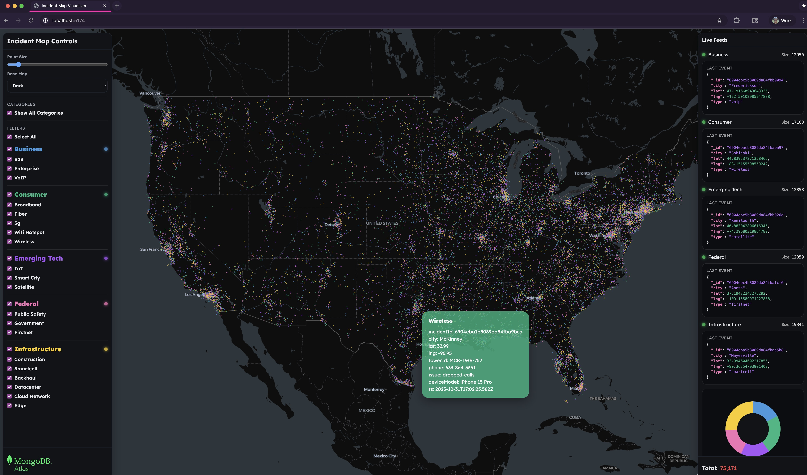

# Incident Visualizer

A real-time map and dashboard that visualizes **telecom incidents** streamed from the [U.S. Incidents Simulator](https://github.com/corbtastik/simulator) into **MongoDB Atlas**.
Each colored point on the map represents a live incident across U.S. cities — categorized into Business, Consumer, Emerging Tech, Federal, and Infrastructure events.
The app continuously polls MongoDB for new activity (via `/live/:category` endpoints) and displays animated updates by category and service type.



---

## 🛰 Summary

The **Incident Visualizer** is the front-end companion to the Simulator. It provides:

* A **map-based live feed** powered by **deck.gl** and **MapLibre**, showing thousands of incidents in motion.
* **Category and filter controls** for focused views (e.g., Wireless, Fiber, Smart City, etc.).
* A **live event panel** showing the latest document per category with timestamps and counts.
* A **donut chart** summarizing total live events by category.
* Smooth, real-time updates via polling of MongoDB’s `incidents_live` and category collections.

It’s designed for demos showcasing **MongoDB Atlas Stream Processing (ASP)** and **real-time analytics pipelines**.

---

## ⚙️ Getting Started

### Prerequisites

* **Node.js 20+**
* **npm** (or **pnpm**)
* A running [Simulator server](https://github.com/corbtastik/simulator)
  → must expose REST endpoints at `http://localhost:5050`

---

### Install and run

```bash
# Clone and enter the repo
git clone https://github.com/corbtastik/incident-visualizer.git
cd incident-visualizer

# Install dependencies
npm install

# Create your environment file
cp .env.example .env

# Start the Vite dev server
npm run dev
```

The UI will start on `http://localhost:5173`.

---

## 🔧 Configuration

Edit the `.env` file to match your setup:

```env
VITE_API_BASE=http://localhost:5050
VITE_MAPTILER_KEY=<your_maptiler_api_key>   # optional, for MapLibre styles
```

* **`VITE_API_BASE`**: URL of the Simulator server (default: `http://localhost:5050`).
* **`VITE_MAPTILER_KEY`**: Optional key for custom map tiles (if not using the default dark base map).
* The app expects `/status`, `/live`, and `/live/:category` endpoints to be available from the simulator.

---

## 🖥️ User Guide

### 1. **Layout Overview**

* **Left Panel — Controls**

  * Adjust point size and base map theme.
  * Toggle visibility of all **categories** (Business, Consumer, Emerging Tech, Federal, Infrastructure).
  * Enable or disable individual **filters** such as “5G,” “Fiber,” “Datacenter,” etc.

* **Main Map**

  * Displays live incident events as color-coded points.
  * Each category uses a distinct color:

    * 🟦 **Business**
    * 🟩 **Consumer**
    * 🟪 **Emerging Tech**
    * 🟥 **Federal**
    * 🟨 **Infrastructure**
  * Hovering over a point reveals a detailed tooltip, e.g.:

    ```
    Wireless
    city: McKinney
    phone: 633-864-3515
    issue: dropped-calls
    deviceModel: iPhone 15 Pro
    ts: 2025-10-31T17:02:25.582Z
    ```

* **Right Panel — Live Feeds**

  * Each category displays the **last event** received.
  * “Size” shows how many documents exist in that MongoDB collection.
  * The **donut chart** at the bottom aggregates total active incidents across all categories.

---

### 2. **Integration with the Simulator**

* The **Simulator** generates incident events and writes them to MongoDB.
* Atlas Stream Processing pipelines categorize each raw event into it's own collection.
* Another Atlas Stream Processing pipeline fixes events.
* The **Visualizer** receives live updates of the incidents through `/live/:category?after=<ObjectId>` endpoints.
* New events stream into the map in near real-time:
  * **Incidents** appear as new points.
  * **Resolutions** (if enabled) fade and disappear as repairs occur.

---

### 3. **Demo Workflow**

1. Start the simulator server:

   ```bash
   cd simulator/server
   npm run dev
   ```
2. Open the Visualizer at `http://localhost:5173`.
3. In the left panel, adjust **Incidents/sec**, **Batch size**, and **Spread** via the simulator UI.
4. Watch the map update live — new colored incidents appear across U.S. cities.
5. Optionally enable **repair mode** in the simulator to watch points resolve and disappear.

---

### 4. **Tech Stack**

* **Frontend:** React + Vite
* **Visualization:** deck.gl + MapLibre GL
* **UI & Charts:** Tailwind CSS + Recharts
* **Data Source:** MongoDB Atlas (via Express server endpoints)

---

## 🧭 Next Steps

* Add time-travel or playback controls to visualize historical data.
* Integrate WebSockets or MongoDB Change Streams for event-driven updates.
* Enable category-based animations for incident resolutions.

---

© 2025 corbtastik — Built for MongoDB Atlas Stream Processing demos.
